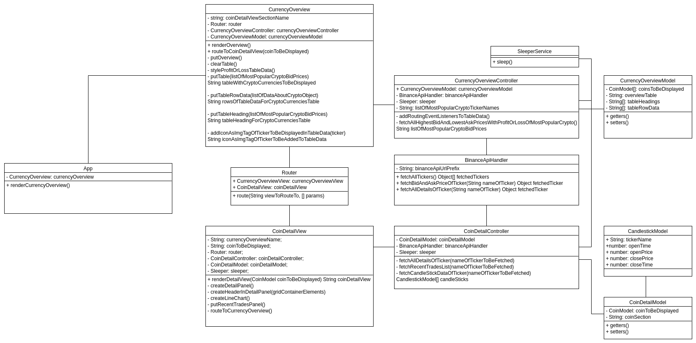

# Web App From Scratch @cmda-minor-web 20-21 ⚙️

This is my repo for the Web App From Scratch course.

## Live :globe_with_meridians:
https://ofahchouch-gh.github.io/web-app-from-scratch-2021/

<p align="center">
  
</p>

## Table of Contents 🗃
* [Description](#description-)
* [Actors & Interaction](#actors--interaction-pencil2)
* [To Do](#to-do-construction)
* [Done](#done-construction_worker)
* [Libraries](#libraries-)
* [Installing](#installing-)
* [API](#api-)
  * [Overview Page](#overview-page)
  * [Coin Detail Page](#coin-detail-page)

## Description 📝
During this course I created a web app from scratch, so without any frameworks, using HTML, CSS and Javascript. The goal is to make a web app from scratch where
i can find an overview of the top 20 cryptocurrencies. The cryptocurrencies will have a detail page where more information about the specific coin is given. 

I chose this idea because i like crypto and the idea behind blockchain. The data i use comes from the [Binance Spot Api](https://github.com/binance/binance-spot-api-docs/blob/master/rest-api.md).
The Binance API is created by the Binance exchange. Everything which can be done manually on their web app related to spot trading can be done/automated with the API as well.

The app will have the current features:

- current avg low & highest bid/ask price of top 20 most popular crypto to trade with
- current avg profit/loss with 1 coin if traded at that moment
- live line chart of selected popular crypto 
- recent trades of selected popular crypto

More info about the endpoints i am using can be found here: [API](#api-).

## Actors & Interaction :pencil2:
<p align="center">
  
</p>

<p align="center">
  
</p>

## To Do :construction:
- error exceptions, refactor & code smells (1 march - 5 march, 4 of minor)

## Done :construction_worker:
- Currencies overview component (1 february - 19 february, week 1, 2 & 3 of minor)
- Coin detail component (8 february - 19 february, week 2 & 3 of minor)

## Libraries :card_file_box:
- Routie http://projects.jga.me/routie/
- Chartist https://gionkunz.github.io/chartist-js/

## Installing 🔍
To install this application enter the following into your terminal (currently works only on Linux/Mac based operating systems):
```
git clone https://github.com/ofahchouch-gh/ofahchouch-gh.web-app-from-scratch.github.io.git

cd ofahchouch-gh.web-app-from-scratch.github.io

(now serve the site: https://www.npmjs.com/package/live-server)
```

## API 🐒
I made use of the following API functionality for this project:

**General API Information**
The base endpoint is https://api.binance.com

All endpoints return either a JSON object or array.
Data is returned in ascending order. Oldest first, newest last.
All time and timestamp related fields are in milliseconds.

**HTTP Return Codes**
HTTP 4XX return codes are used for malformed requests; the issue is on the sender's side.
HTTP 403 return code is used when the WAF Limit (Web Application Firewall) has been violated.
HTTP 429 return code is used when breaking a request rate limit.
HTTP 418 return code is used when an IP has been auto-banned for continuing to send requests after receiving 429 codes.
HTTP 5XX return codes are used for internal errors; the issue is on Binance's side.
With using /wapi/v3 , HTTP 504 return code is used when the API successfully sent the message but not get a response within the timeout period. It is important to NOT treat this as a failure operation; the execution status is UNKNOWN and could have been a success.

**General Information on Endpoints**
For GET endpoints, parameters must be sent as a query string.
For POST, PUT, and DELETE endpoints, the parameters may be sent as a query string or in the request body with content type application/x-www-form-urlencoded. You may mix parameters between both the query string and request body if you wish to do so.
Parameters may be sent in any order.
If a parameter sent in both the query string and request body, the query string parameter will be used.

**General info on Rate Limits** 
The following intervalLetter values for headers:
  - SECOND => S
  - MINUTE => M
  - HOUR => H
  - DAY => D

intervalNum describes the amount of the interval. For example, intervalNum 5 with intervalLetter M means "Every 5 minutes".
The /api/v3/exchangeInfo rateLimits array contains objects related to the exchange's RAW_REQUEST, REQUEST_WEIGHT, and ORDER rate limits. These are further defined in the ENUM definitions section under Rate limiters (rateLimitType).
A 429 will be returned when either rate limit is violated.

When we call /api/v3/exchangeInfo we will receive the current info about the rate limit.

{
    "rateLimitType":"REQUEST_WEIGHT",
    "interval":"MINUTE",
    "intervalNum":1,
    "limit":1200
}

So we can make 20 (1200/60) requests per second.

**IP Limits**
Every request will contain X-MBX-USED-WEIGHT-(intervalNum)(intervalLetter) in the response headers which has the current used weight for the IP for all request rate limiters defined.
Each route has a weight which determines for the number of requests each endpoint counts for. Heavier endpoints and endpoints that do operations on multiple symbols will have a heavier weight.
When a 429 is received, it's your obligation as an API to back off and not spam the API.
Repeatedly violating rate limits and/or failing to back off after receiving 429s will result in an automated IP ban (HTTP status 418).
IP bans are tracked and scale in duration for repeat offenders, from 2 minutes to 3 days.
A Retry-After header is sent with a 418 or 429 responses and will give the number of seconds required to wait, in the case of a 429, to prevent a ban, or, in the case of a 418, until the ban is over.
The limits on the API are based on the IPs, not the API keys.

## Overview Component
- Current Average Price
  - GET /api/v3/avgPrice
  - Current average price for a symbol.
  - Weight: 1
  - Parameters:
    - symbol	STRING	MANDATORY
  - Response:
    - { "mins": 5, "price": "9.35751834" }

## Coin Detail Component
- Recent Trades List
  - GET /api/v3/trades
  - Get recent trades.
  - Weight: 1
  - Parameters:
    - symbol	STRING	MANDATORY	
    - limit	INT	NOT MANDATORY	Default 500; max 1000.
  - Response:
    - [{
      -  "id": 28457,
      -  "price": "4.00000100",
      -  "qty": "12.00000000",
      -  "quoteQty": "48.000012",
      -  "time": 1499865549590,
      -  "isBuyerMaker": true,
      -  "isBestMatch": true }]
- Kline/Candlestick Data
  - GET /api/v3/klines
  - Kline/candlestick bars for a symbol. Klines are uniquely identified by their open time.
  - Weight: 1
  - Parameters:
    - symbol	STRING	MANDATORY	
    - interval	ENUM	MANDATORY
    - startTime	LONG	NOT MANDATORY
    - endTime	LONG	NOT MANDATORY
    - limit	INT	NOT MANDATORY	Default 500; max 1000.
  - Response:
    - [[
      -  1499040000000,      // Open time
      -  "0.01634790",       // Open
      -  "0.80000000",       // High
      -  "0.01575800",       // Low
      -  "0.01577100",       // Close
      -  "148976.11427815",  // Volume
      -  1499644799999,      // Close time
      -  "2434.19055334",    // Quote asset volume
      -  308,                // Number of trades
      -  "1756.87402397",    // Taker buy base asset volume
      -  "28.46694368",      // Taker buy quote asset volume
      -  "17928899.62484339" // Ignore. ]]
